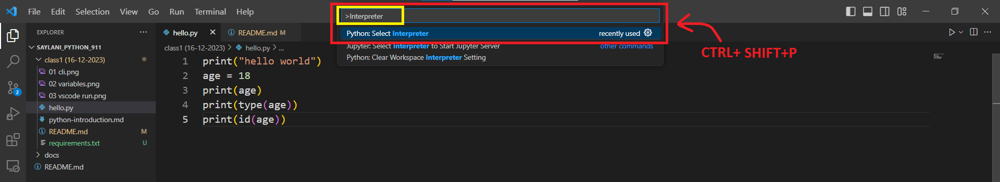
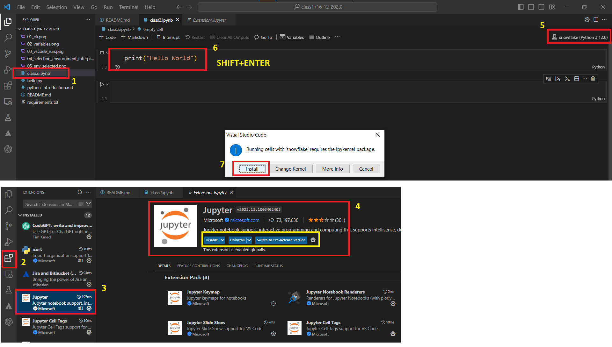

# Saylani Python Programming (9:00pm to 11:00pm)

## class1 - Project Setup Guide

This guide explains how to set up the development environment using Anaconda, Visual Studio Code (VS Code), Python & Gitbash for Version Controlling.

### Prerequisites

- [Anaconda](https://www.anaconda.com/products/individual#Downloads)
- [VS Code](https://code.visualstudio.com/Download)
- [GitBash](https://git-scm.com/downloads)

### Installation Guide

- [Anaconda Installation Guide](https://github.com/aiwithqasim/Saylani_Python_911/blob/dev/docs/Anaconda%26%20JupyterNotebook%20Installation.pdf)
- [GitBash Installation Guide](https://github.com/aiwithqasim/Saylani_Python_911/blob/dev/docs/GtiBash%20Installation.pdf)
- [VsCode Installation Guide](https://code.visualstudio.com/Download)

---

## TABLE OF CONTENT

1. [Running a "Hello World" Program](#running-a-hello-world-program)
2. [Setting Up a Virtual Environment](#setting-up-a-virtual-environment)

## Running a "Hello World" Program

You can run a simple "Hello World" program to ensure that your python setup is working as expected.

### Using Command Prompt on Windows

1. Open Command prompt
2. Run the following Python command:

    ```bash
    print("Hello Saylani...!!!")
    ```

### Using VS Code (.py file)

1. Open VS Code and create a new Python file called `class1.py`.
2. Write the following Python code:

    ```python
    print("Hello world")
    ```

3. Install the Python extension for VS Code if you haven't done so.
4. Click on the Run button to execute the code.

### Using VS Code (.ipynb file)

1. Open VS Code and create a new Jupyter Notebook called `class1.ipynb`.
2. Insert the following Python code into a new cell:

    ```python
    print("Hello world")
    ```

3. Click on the Run button to execute the cell.

---

## Setting Up a Virtual Environment

### Creating a New Environment

1. Run the following command to create a new Conda environment:

    ```bash
    conda create -n <env_name> python==3.12 -y
    # Example: conda create -n python12 python==3.12 -y
    ```

2. Activate your newly created environment:

    ```bash
    conda activate <env_name>
    # Example: conda activate python12
    ```

3. Check names of your already created environments lists

    ```bash
    conda env list
    ```

### Installing Required Packages

1. Create a `requirements.txt` file with the following content:

    ```
    numpy
    ```

2. Run the following command to install the required packages:

    ```bash
    pip install -r requirements.txt
    ```
3. For more relevant commands following are the suitable links

    - [Managing conda environments](https://conda.io/projects/conda/en/latest/user-guide/tasks/manage-environments.html#activating-an-environment)
    - [Virtual Environment Creation - conda/venv](https://github.com/aiwithqasim/Saylani-AI-Batch2/blob/main/03%20Python/README.md)

### Selecting the Environment in VS Code

1. Open `class1.py` in VS Code.
2. Select your virtual environment as shown below:




### Selecting the Environment in Jupyter Notebook

1. Open `class1.ipynb` in Jupyter Notebook.
2. Select your virtual environment as shown below:



---


