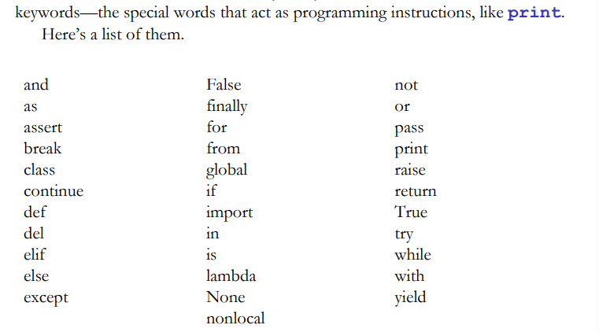
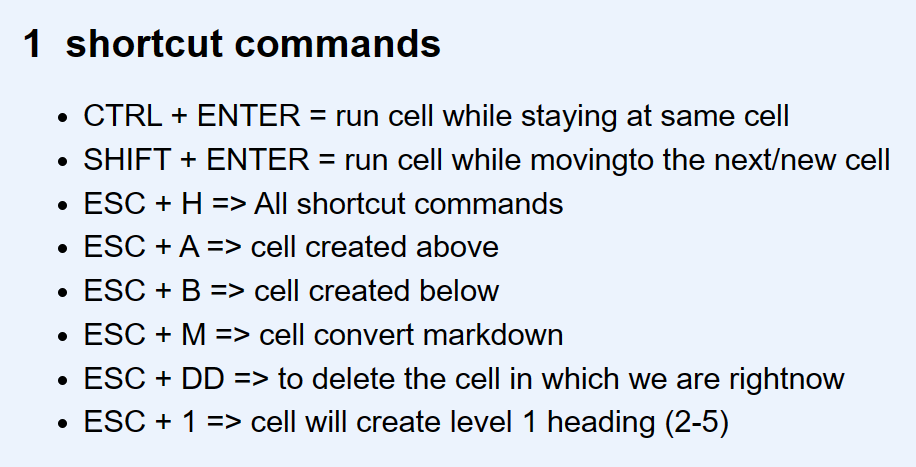

# Saylani Python Programming (9:00pm to 11:00pm)

## class3 - Varibales & Operators

## TABLE OF CONTENT

1. Variables for Strings
    - NOTE: variable name should be precise & meaningful
2. Variables for Numbers
3. Math expressions: Familiar operators (+,-,*,/,//,**, -(-))
4. Variable Names Legal and Illegal (keywords)



5. Math expressions: Unfamiliar operators (Modulus & increments)
6. Math expressions: Eliminating ambiguity (BODMAS)

```python
((2 * 4) * 4) + 2
```

```python
(2 * 4) * (4 + 2)
```

7. Some important  Jupyter commands are:




